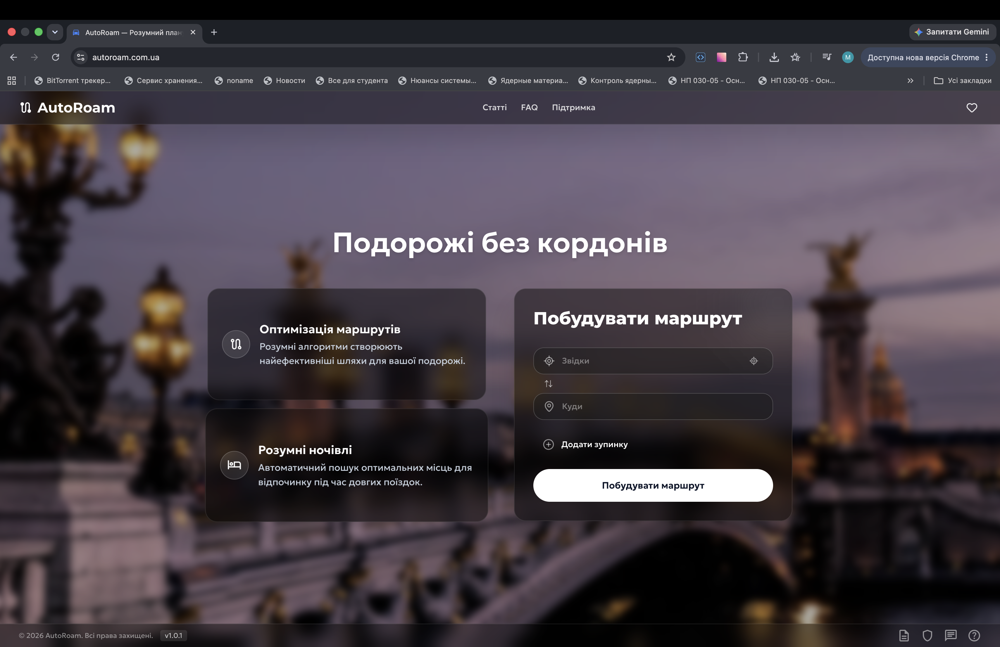
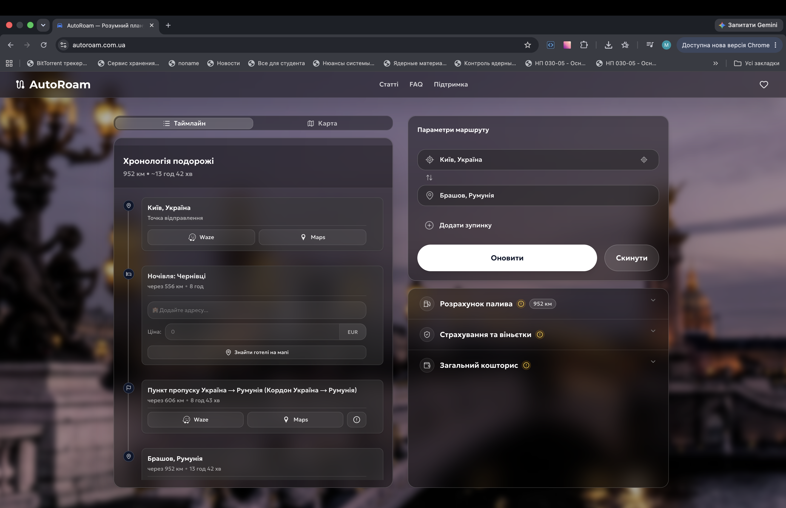
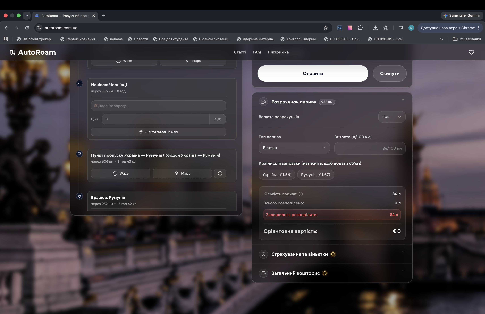
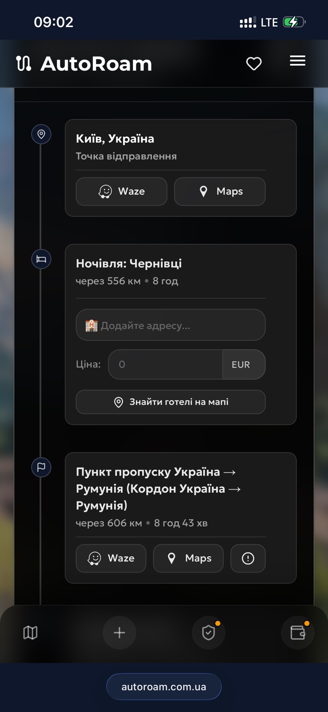
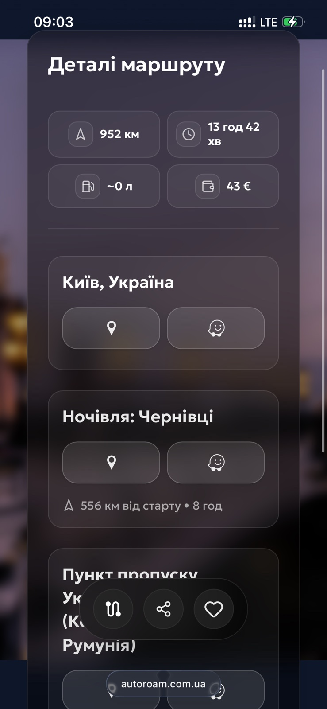
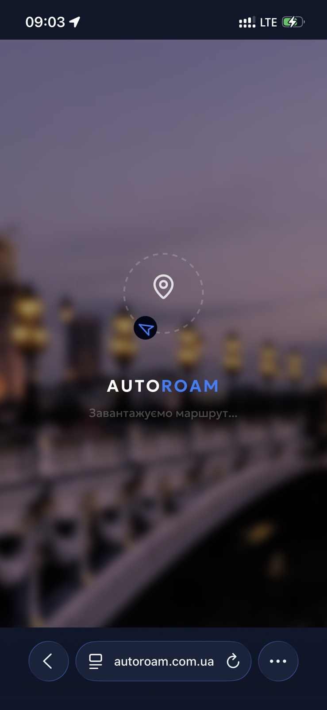
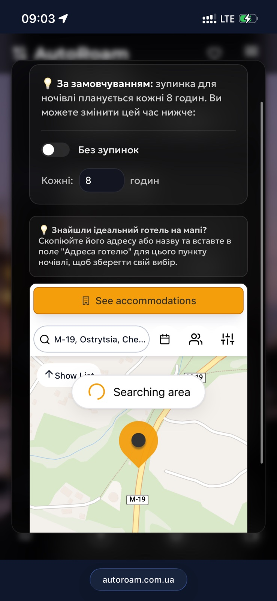
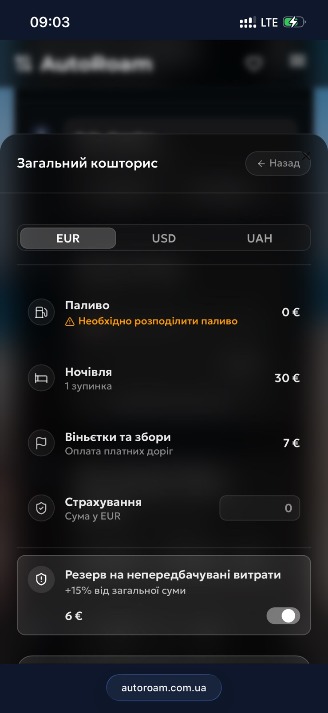

<div align="center">
  
  # AutoRoam
  **PWA Планувальник Автомобільних Подорожей**

  [](https://nextjs.org/)
  [](https://reactjs.org/)
  [](https://www.typescriptlang.org/)
  [](https://tailwindcss.com/)

  **🌍 Офіційний сайт: [autoroam.com.ua](https://autoroam.com.ua)**
</div>

---

AutoRoam — це розумний веб-додаток (Progressive Web App) для водіїв, який перетворює планування далекої автомобільної подорожі з хаосу вкладок на єдиний зрозумілий таймлайн. Додаток автоматизує розрахунки бюджету, пошук місць для ночівлі та надає актуальну інформацію про перетин кордонів і віньєтки.

## 🖼️ Галерея Інтерфейсу

<p align="center">
  
  
</p>
<p align="center">
  
  
</p>

### 📱 Мобільна версія

<p align="center">
  
  
  
  
  
</p>

## 💡 Ідея проекту
Звичайна навігація (як Google Maps) добре показує шлях, але не відповідає на ключові питання мандрівника: "Скільки це коштуватиме?", "Де мені доведеться зупинитися на ніч?", "Які кордони я перетинатиму і що там з платними дорогами?".
AutoRoam вирішує ці проблеми, створюючи єдиний контекст подорожі, де маршрут розбивається на логічні відрізки та "розумні зупинки".

## 🎨 UI/UX Дизайн та Адаптивність
Додаток використовує концепцію "Split View" (розділений екран) на десктопах з динамічним фото-фоном країн світу:
- **Ліва панель (Візуалізація):** Інформаційне вікно з описом можливостей або (після розрахунку) "Trip Timeline" — вертикальна візуальна шкала подорожі, де всі зупинки розташовані у хронологічному порядку.
- **Права панель (Управління):** Форма для вводу старту та фінішу, під якою розташовані "Розумні панелі" у вигляді акордеону:
  - ⛽ **Пальне:** Калькулятор витрат на основі розходу вашого авто з 10% запасом.
  - 🏨 **Ночівля:** Автоматична генерація зупинок (наприклад, кожні 8 годин) з прив'язкою до реальних міст на маршруті. Монетизовано через партнерську програму (Stay22).
  - 🛂 **Кордони:** Автоматичне виявлення перетину країн та динамічне підтягування посилань на покупку віньєток.
  - 💰 **Бюджет:** Агрегатор усіх витрат з підтримкою мультивалютності (USD, EUR, UAH, PLN) та опціональним 15% резервом.
  - 🛡️ **Страхування:** Рекомендації та реферальні посилання на оформлення Зеленої картки, туристичного страхування тощо (Hotline.Finance).

### 📱 Мобільна версія (PWA)
Для мобільних пристроїв реалізовано повністю адаптивний, нативний інтерфейс:
- **Нижня панель навігації (Bottom Bar):** Швидке перемикання між основними екранами однією рукою (Карта, Таймлайн, Додати зупинки, Деталі).
- **Виїжджаюча карта (Map Sheet):** Карта більше не просвічується у фоні, а відкривається як повноцінне вікно, що виїжджає знизу (h-[85vh]) за кліком на іконку навігації.
- **Оптимізований скролл:** Позбулися подвійного скролу; таймлайн використовує нативний скролл сторінки, а виїжджаючі панелі мають виправлений flex-скрол (`min-h-0`) для плавності.

## 🛠 Технологічний стек
Проект побудовано на сучасних безкоштовних технологіях з акцентом на швидкість:
- **Core:** Next.js 16 (App Router), React 19, TypeScript
- **State Management:** Zustand (глобальний store)
- **Styling & UI:** Tailwind CSS, shadcn/ui (Radix UI), Lucide Icons
- **Mapping:** Leaflet, React-Leaflet
- **Routing & Geocoding (Open Source):**
  - **OSRM (Open Source Routing Machine):** для розрахунку геометрії маршруту.
  - **Nominatim (OpenStreetMap):** для прямого геокодування.
  - **BigDataCloud API:** для зворотного геокодування (точне знаходження кордонів та міст для ночівлі).

## 🚀 Використання та Розробка

**Додаток вже доступний онлайн!** Ви можете планувати свої подорожі за посиланням:
👉 **[autoroam.com.ua](https://autoroam.com.ua)**

Якщо ви хочете запустити проект локально для тестування чи розробки:

```bash
# Встановлення залежностей
npm install

# Запуск локального сервера розробки
npm run dev
```

Відкрийте [http://localhost:3000](http://localhost:3000) у вашому браузері.
